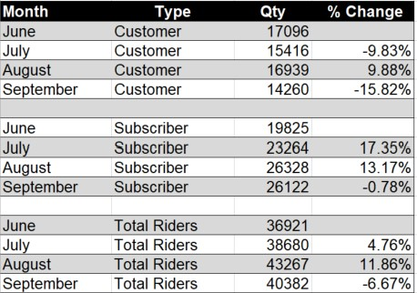
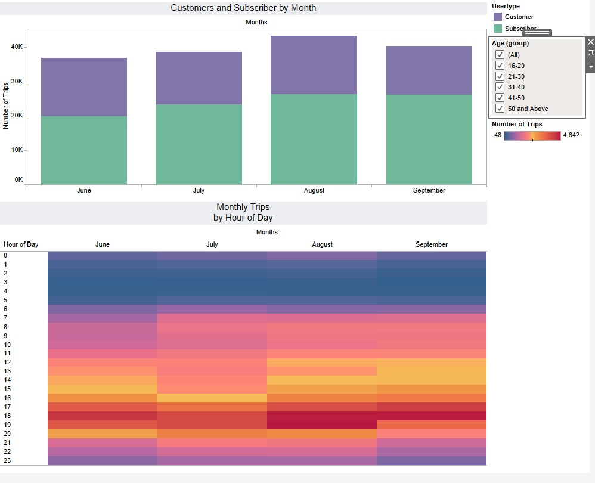

# Tableau

The data analyzed was June – September 2020. The changes is ridership appear to by cyclical by season. Higher in the summer months and less going into fall.

## Riders

For the months presented the 31-40 age group had the most ridership for July, August and September. For June the 51 and older had the highest ridership. The average was 39.5.

Males riders were the largest group at 54.66%, female, 25.82% and unknown at 19.52%.

## Trips

For the 4 month period our average trip time was 31 minutes, June average was the highest at 38 minutes per trip. The most popular ride time of the day for the months presented is between 6 and 7 pm.

